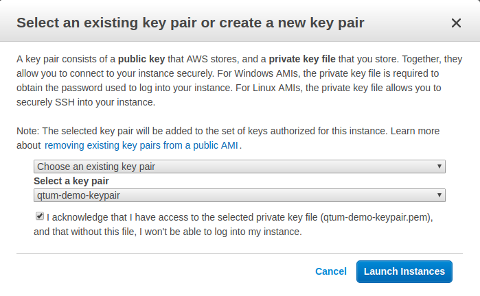

# Staking QTUM with Amazon EC2

### Prerequisites
___
* An AWS account. If you aren't already a customer, every new account (with a valid credit card that hasn't been used for a previous account) is valid for 12 months of the [AWS Free Tier](https://aws.amazon.com/free/), which includes 750 hours a month of EC2 resources, which can keep your node staking 24/7.

* Familiarity with Linux and terminal usage. This guide will be using an Ubuntu image as the remote EC2 instance, and Ubuntu 16.04 desktop as a client to connect to the EC2 server (instructions should work for any Debian-based system as well).

* Understand how the `root` and `ubuntu` users [are managed in Ubuntu EC2 instances](https://alestic.com/2009/04/ubuntu-ec2-sudo-ssh-rsync/)

#### A brief note on security

This guide isn't to discuss the relative benefits of any security software, password store, or patterns. The weakest link is always us. Do some reading and evaluate the tools that work for you. The best security pattern is one you understand and actually use, consistently.

Cloud password managers like [LastPass](https://www.lastpass.com/) are not perfect, but provide a good balance of usability and security. Client-side decryption, browser plug-in, and bundled 2FA private key storage works well.

From here on I'll assume you know how to secure passwords. This means [not storing private keys in plain text in Evernote](https://ethereumworldnews.com/notable-cryptocurrency-influencer-looses-over-1-million-to-hacker/).

### 1 Provision an Ubuntu EC2
___

1. Create an AWS account - use the Free Tier if you aren't already an account holder.
2. Recommended - add a multi-factor authentication method to login to AWS. Find the _My Security Credentials_ section in your account:

 

 Add the MFA of your choice:

 

3. Create a SSH keypair on your client system so we can remote to AWS securely later on.

 ```
 $ ssh-keygen -t rsa
 ```
 * You will be asked to enter a location for your key. The default is `~/.ssh/id_rsa`.
 * Recommended - enter a passphrase for the private key and store it securely. If your file system is compromised on your client system, the attacker will have to additionally know your passphrase to be able to read the file. The downside is that you have to enter the passphrase each time you access the file. A reasonable compromise.
 * Output will look similar to:

 ```
 Generating public/private rsa key pair.
 Enter file in which to save the key (/home/user/.ssh/id_rsa):
 Enter passphrase (empty for no passphrase):
 Enter same passphrase again:
 Your identification has been saved in /home/user/.ssh/id_rsa.
 Your public key has been saved in /home/user/.ssh/id_rsa.pub.
 The key fingerprint is:
 SHA256:kHXeJZtDbsb5AsWLmJfQqhkFJ+sHQiqWgaeiMGIT0SM user@ubuntu-evo850
 The key's randomart image is:
 +---[RSA 2048]----+
 |.oo . o.o...+ .  |
 |.E+=   *oo.*.*   |
 |.=+ o =. =oo@.   |
 |B+   o.o+ ++.o   |
 |*..   .+S.  . .  |
 |.     o.     .   |
 |                 |
 |                 |
 |                 |
 +----[SHA256]-----+
 ```

 Alternatively, you can use the native keypair generation inside AWS and store the PEM encoded private key on your client system. The downside is that you have to transfer the private key across the wire. It's somewhat better to create a keypair yourself and only have the public key leave your system

4. Select _EC2_ from the _Services_ top menu. Scroll to the _Key Pairs_ section under the _Network and Security_ sub-heading on the left navigation pane:

 

 Select the _Import Key Pair_ and paste in the contents of the *public* SSH keyfile (_ending in .PUB_) you created earlier. This will be used in our security configuration while setting up the EC2 instance.

 

5. Select _EC2_ from the _Services_ top menu.

 

6. Click _Launch Instance_ (Under the Free Tier you may be forced to use the US East availability region)

 

7. Select the _Ubuntu Server_ AMI

 

 On the next screen - you can select a `t2.micro` instance. This is more than enough resources to run a full QTUM node. Note - it uses EBS storage so if you delete your instance you will lose your data. Restarting the instance however, is fine.

8. Click on _Next: Configure Instance Details_, leave the defaults as they are for this section.

9. Click on _Next: Add Storage_, leave the defaults as they are for this section.

10. Click on _Next: Add Tags_, leave the defaults as they are for this section.

11. _Configure Security Group_ - this part is important.

 

 Create a new security group for SSH access with some meaningful name and description.

 Recommended - if you leave the _Source_ section open to 0.0.0.0/0 this means _all_ IP ranges will be able to login to this security group. You may want to restrict this to a single IP (or range) of the client system you will use to manage the QTUM node. This might seem restricting, and it is - deliberately, but you are going to manage the QTUM node via SSH, and the private key will probably only reside on a single system. So if that has a dedicated IP (or range), then lock it down for improved security.

 Note: As long as you have access to your AWS account you can always alter the security group later if need be.

12. Click _Review and Launch_ and review your settings. Click _Lauch_, and you will be prompted to select a key pair for this instance

 

 Choose an existing key pair - the one you created earlier. Tick the acknowledgement you control the private key for this pair, and hit _Launch Instances_. Your instance will start initialising.

13. Return to the _EC2 Dashboard_, under the _Resources_ heading click the _... Running Instances_ link. You will then see your EC2 instance up and running. You are now ready to login via SSH from your client machine.

 Right click the line-item for your instance and click the _Connect_ item. Example instructions shown below:

 

 Follow the instructions for your private keyfile name and IP address noted for your EC2 instance. Remember you may need to change the file attributes of the private key as shown. Using the default keystore location and keypair created earlier, the command will be (replacing with whatever hostname your instance is, of course):

 `$ ssh -i /home/user/.ssh/id_rsa ubuntu@ec2-34-229-134-181.compute-1.amazonaws.com`

  (You may need unlock using the passphrase if you created one and the file is not already unlocked)

## 2 Installing QTUM
___

1. Obtain the QTUM signing key:

 ```
 $ sudo apt-key adv --keyserver keyserver.ubuntu.com --recv-keys BF5B197D
 ```
 * Best practice: verify this is correct and this page is not to serve you malicious software. QTUM project reference: https://github.com/qtumproject/qtum/wiki/Setting-up-QTUM-Ubuntu,-Debian-and-Mint-repository


2. Add QTUM repository to your APT sources:

  ```
  $ sudo tee -a /etc/apt/sources.list.d/qtum.list <<EOF  
  deb http://repo.qtum.info/apt/ubuntu/ $(lsb_release -c | cut -f2) main
  EOF
  ```  

3. Update your sources and install QTUM:

 ```
 $ sudo apt update && sudo apt install qtum
 ```

4. Create a service to restart qtumd on reboot:  

  ```
  $ sudo tee -a /etc/systemd/system/qtumd.service <<EOF
  [Unit]
  Description=QTUM daemon
  After=network.target

  [Service]
  Type=forking
  User=ubuntu
  WorkingDirectory=/home/ubuntu/.qtum
  ExecStart=/usr/local/bin/qtumd -daemon=1 -par=2 -onlynet=ipv4 -noonion -listenonion=0 -maxconnections=24 -rpcbind=127.0.0.1 -rpcallowip=127.0.0.1
  PIDFile=/home/ubuntu/.qtum/qtumd.pid
  Restart=always
  RestartSec=1
  KillSignal=SIGQUIT
  KillMode=mixed
  EOF
  ```

5. Now start the daemon

  ```
  $ sudo systemctl daemon-reload \
  && sudo systemctl enable qtumd.service \
  && sudo systemctl start qtumd.service
  ```

6. To verify everything is working, you can now check:

  ```
  $ qtum-cli getwalletinfo
  ```

  You'll get some output like:
  ```
  {
    "walletversion": 130000,
    "balance": 0.00000000,
    "stake": 0.00000000,
    "unconfirmed_balance": 0.00000000,
    "immature_balance": 0.00000000,
    "txcount": 0,
    "keypoololdest": 1526566081,
    "keypoolsize": 100,
    "paytxfee": 0.00000000,
    "hdmasterkeyid": "9b8a7adf48844e501f730a3a99fbfee0508b83f3"
  }
  ```

## 3 Encrypt your wallet
___

1. Run
  `$ qtum-cli encryptwallet "your password"`


  Output
  ```
  wallet encrypted; Qtum server stopping, restart to run with encrypted wallet. The keypool has been flushed and a new HD seed was generated (if you are using HD). You need to make a new backup.
  ```

## 4 Backup your wallet file
___

1. Open a new terminal window on your _client_ system

2. Now use `scp` to securely transfer your now encrypted wallet to your client system as backup. Update this command to match your SSH private key file, remote host, and location to store the wallet.

  `$ scp -i  /home/user/.ssh/id_rsa ubuntu@ec2-18-206-236-46.compute-1.amazonaws.com:/home/ubuntu/.qtum/wallet.dat ~/path_to_backup/location`

3. Confirm wallet.dat exists in your backup location. Make multiple backups.

## 5 Set up for staking
___

1. Back on the remote EC2, unlock your wallet for staking (for the maximum time):

  `$ qtum-cli walletpassphrase "your password" 999999999 true`

## 6 Send QTUM to your wallet
___

1. Reveal your addresses to send QTUM to:

  `$ qtum-cli getaccountaddress "account_name"`

  In this command the string at the end is the account nickname. For simplicity I would simply name them numerically:

  ```
  $ qtum-cli getaccountaddress "0" \
  && qtum-cli getaccountaddress "1" \
  && qtum-cli getaccountaddress "2" \
  && qtum-cli getaccountaddress "." \
  && qtum-cli getaccountaddress "n"
  ```

  Why bother sending your QTUM to more than one address for staking?

  Because of the way staking works. When an account in the wallet is chosen to receive a staking reward, the QTUM in that account needs to be re-matured for another 500 blocks before it contributes to your staking weight again. To maximise your staking weight over time you would want this address to be as small a portion of your total balance as possible.

  This may not make seem to make difference if you have 10 QTUM, as your average time to generate any rewards is huge, 500 blocks will have a very small effect on your returns. But if you're staking 10,000 QTUM, this could make a significant difference to your returns as rewards are far more frequent.

2. Send your QTUM to your newly revealed address. Perhaps send small first to verify everything is in order.

## 7 Wait for your QTUM to mature

1. Calling `$ qtum-cli getstakinginfo` will show your staking status:

Example output while QTUM are still maturing:
  ```
  {
    "enabled": true,
    "staking": false,
    "errors": "",
    "currentblocksize": 0,
    "currentblocktx": 0,
    "pooledtx": 10,
    "difficulty": 4199703.023112798,
    "search-interval": 0,
    "weight": 0,
    "netstakeweight": 1962997063489867,
    "expectedtime": 0
  }
  ```

Come back in 500 blocks after you've sent your QTUM.

## 8 Security Checklist

Double-check you have access and control of everything listed.

*AWS*
* AWS login password
* AWS multfactor device or method

If someone can access your AWS account they can simply change the Security Group the EC2 belongs to, with a new public key created from a private key they control, and then access your EC2. This shouldn't be a catastrophic issue - as the wallet is only unlocked for staking. They will not be able to send from it without knowing the QTUM wallet encryption passphrase.

*On the EC2 instance*
* QTUM wallet.dat file
* QTUM wallet encryption password

Losing the wallet.dat file is fine, even if you accidentally tear down the EC2 instance, as you have a backup(s) on your local machine, which you can instantly fire up with a local QTUM install.

Losing the wallet encryption password is catastrophic, as you will never be able to open the wallet for _sending_ again.

*On the local system you manage the QTUM node from*
* Backup of the QTUM wallet.dat
* SSH private keyfile to SSH into the QTUM remote node
* Passphrase for file access to your SSH keyfile

Losing your wallet.dat backups is OK, you can always repeat the `scp` commands on a new system to get another backup. Keep a few backups in different locations regardless. They are encrypted with your password so even if someone has access to the file it will be useless to them.

Losing the SSH private keyfile if that happens not desired but you can easily generate a new one and update your security group in AWS with a new public key. You might want to do this if you format your local machine or administer it from a different system.


## Other references and guides
___

* Sign up for free encrypted email at [ProtonMail](https://protonmail.com/) if you need a new identity for your AWS Free Tier.
