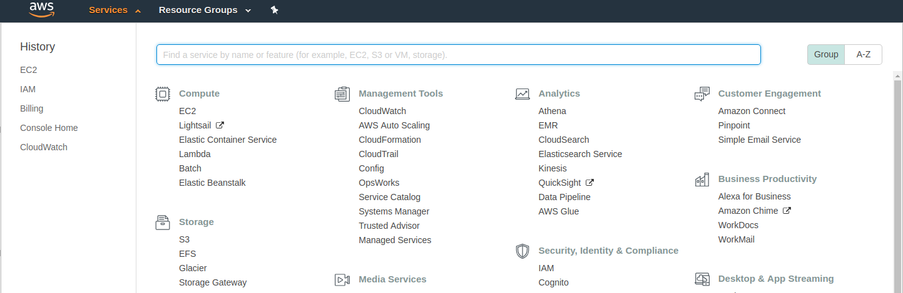

# Staking QTUM with Amazon EC2

### Prerequisites
* An AWS account. If you aren't already a customer, every new account (with a valid credit card that hasn't been used for a previous account) is valid for 12 months of the [AWS Free Tier](https://aws.amazon.com/free/), which includes 750 hours a month of EC2 resources, which can keep your node staking 24/7.

* Familiarity with Linux and terminal usage. This guide will be using an Ubuntu instance as the remote EC2 instance, and any Debian-based Linux operating system as a client to connect to the EC2 server.

* Understand how the `root` and `ubuntu` users [are managed in Ubuntu EC2 instances](https://alestic.com/2009/04/ubuntu-ec2-sudo-ssh-rsync/)

#### A brief note on security

This guide isn't to discuss the relative benefits of any security software, password store, or patterns. The weakest link is always us. Do some reading and evaluate the tools that work for you. The best security pattern is one you understand and actually use, consistently.

Cloud password managers like [LastPass](https://www.lastpass.com/) are not perfect, but provide a good balance of usability and security. Client-side decryption, browser plug-in, and bundled 2FA private key storage works well.

From here on I'll assume you know how to secure passwords. This means [not storing private keys in plain text in Evernote](https://ethereumworldnews.com/notable-cryptocurrency-influencer-looses-over-1-million-to-hacker/).

### Instructions

1. Create an AWS account - use the Free Tier if you aren't already an account holder.
2. Recommended - add a multi-factor authentication method to login to AWS. Find the _My Security Credentials_ section in your account:

 

 Add the MFA of your choice:

 

3. Create a SSH keypair on your client system so we can remote to AWS securely later on.

 ```
 $ ssh-keygen -t rsa
 ```
 * You will be asked to enter a location for your key. The default is `~/.ssh/id_rsa`.
 * Recommended - enter a passphrase for the private key and store it securely. If your file system is compromised on your client system, the attacker will have to additionally know your passphrase to be able to read the file. The downside is that you have to enter the passphrase each time you access the file. A reasonable compromise.
 * Output will look similar to:

 ```
 Generating public/private rsa key pair.
 Enter file in which to save the key (/home/user/.ssh/id_rsa):
 Enter passphrase (empty for no passphrase):
 Enter same passphrase again:
 Your identification has been saved in /home/user/.ssh/id_rsa.
 Your public key has been saved in /home/user/.ssh/id_rsa.pub.
 The key fingerprint is:
 SHA256:kHXeJZtDbsb5AsWLmJfQqhkFJ+sHQiqWgaeiMGIT0SM user@ubuntu-evo850
 The key's randomart image is:
 +---[RSA 2048]----+
 |.oo . o.o...+ .  |
 |.E+=   *oo.*.*   |
 |.=+ o =. =oo@.   |
 |B+   o.o+ ++.o   |
 |*..   .+S.  . .  |
 |.     o.     .   |
 |                 |
 |                 |
 |                 |
 +----[SHA256]-----+
 ```

 Alternatively, you can use the native keypair generation inside AWS and store the PEM encoded private key on your client system. The downside is that you have to transfer the private key across the wire. It's somewhat better to create a keypair yourself and only have the public key leave your system

4. Select _EC2_ from the _Services_ top menu. Scroll to the _Key Pairs_ section under the _Network and Security_ sub-heading on the left navigation pane:

 

 Select the _Import Key Pair_ and paste in the contents of the *public* SSH keyfile (_ending in .PUB_) you created earlier. This will be used in our security configuration while setting up the EC2 instance.

 

5. Select _EC2_ from the _Services_ top menu.

 

6. Click _Launch Instance_ (Under the Free Tier you may be forced to use the US East availability region)

 

7. Select the _Ubuntu Server_ AMI

 

 On the next screen - you can select a `t2.micro` instance. This is more than enough resources to run a full QTUM node. Note - it uses EBS storage so if you delete your instance you will lose your data. Restarting the instance however, is fine.

7. Click on _Next: Configure Instance Details_, leave the defaults as they are for this section.

8. Click on _Next: Add Storage_, leave the defaults as they are for this section.

9. Click on _Next: Add Tags_, leave the defaults as they are for this section.

10. _Configure Security Group_ - this part is important.

 

 * Create a new security group for SSH access with some meaningful name and description. Optional - if you leave the _Source_ section open to 0.0.0.0/0 this means _all_ IP ranges will be able to login to this security group. Depending on your requirements and setup, you may want to restrict this to a single IP (or range) of the client system you will use to manage the QTUM node.

 * This might seem restricting, and it is - deliberately, but you are going to manage the QTUM node via SSH, and the private key will probably only reside on a single system. So if that has a dedicated IP (or range), then go right ahead.

 * Note: As long as you have access to your AWS account you can always alter the security group later if need be.

11. Click _Review and Launch_ and review your settings. Click _Lauch_, and you will be prompted to select a key pair for this instance

 

 Choose an existing key pair - the one you created earlier. Tick the acknowledgement you control the private key for this pair, and hit _Launch Instances_. Your instance will start initialising.

12. Return to the _EC2 Dashboard_, under the _Resources_ heading click the _... Running Instances_ link. You will then see your EC2 instance up and running. You are now ready to login via SSH from your client machine.

 Right click the line-item for your instance and click the _Connect_ item. Example instructions shown below:

 

 Follow the instructions for your private keyfile name and IP address noted for your EC2 instance. Remember you may need to change the file attributes of the private key as shown. Using the default keystore location and keypair created earlier, the command will be:

 `$ ssh -i /home/user/.ssh/id_rsa ubuntu@ec2-34-229-134-181.compute-1.amazonaws.com`

  (You may need unlock using the passphrase if you created one and the file is not already unlocked)


### Other reference links

* Sign up for free encrypted email at [ProtonMail](https://protonmail.com/) if you need a new identity for your AWS Free Tier.
